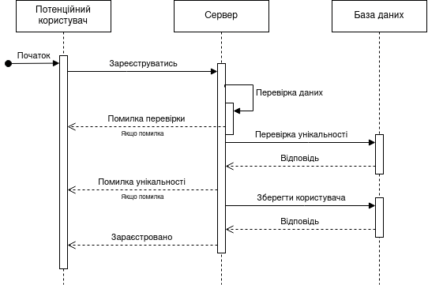
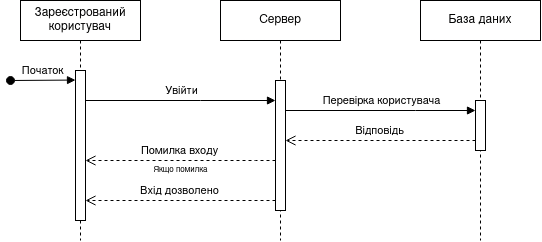
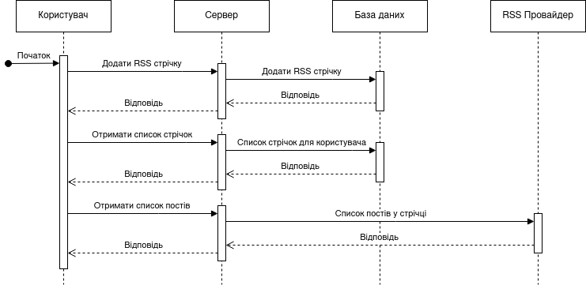
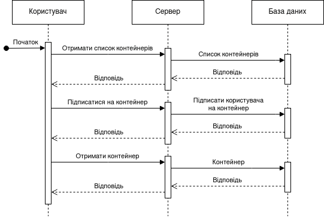

# Application Requirements

## Functional Requirements

### Main Application Windows

#### 1. Login Page

- On this page, a registered user can log in to their previously created account. To do so, they must provide an email address and password.

  - If the email or password is incorrect, the user will be notified and prompted to retry with correct credentials.

  - If the email and password are correct, the user will be logged in (redirected to the Main Page).

- A new (unregistered) user can register (redirected to the Registration Page).

#### 2. Registration Page

- On this page, an unregistered user can sign up by providing their name, email address, and creating a password. After successful registration, they will be able to log in (redirected to the Login Page).

- A registered user can navigate to the Login Page for authentication.

The following pages are accessible only to registered users. These pages share a common top and side panel with the following functionality:

1. **Top Panel:**

   - Users can subscribe to a new RSS feed by entering an RSS link in the search field and clicking "+". The selected RSS feed will be added to their subscriptions.
   - Users can view and edit their profile details or log out.

2. **Side Panel:** Composed of two sections: **Feeds** and **Cargos**.

   - **Feeds:**

     - **All** - Displays all RSS feeds and redirects to the Main Page.
     - **Followed** - A dropdown menu listing subscribed RSS feeds. Selecting an item filters the articles on the Main Page to show content only from the chosen source.

   - **Cargos:**
     - **Follow New** - Redirects the user to the Cargo Page New.
     - **Followed** - A dropdown menu listing subscribed "containers," allowing navigation to the Cargo Page Followed.

#### 3. Main Page

Users can browse articles from all subscribed sources, sorted by publication date. They can select an article to read its original source.

#### 4. Cargo Page Followed

Users can view their subscribed "containers." Each container displays its name and a list of associated sources. Selecting a container filters articles to show only those from that container (redirecting to the Main Page).

#### 5. Cargo Page New

Users can explore available "containers" they have not yet subscribed to. Each container's content is visible, and users can subscribe to chosen containers, moving them to the Followed list.

---

## Non-Functional Requirements

### Interface Requirements

- The interface language is **English only** (no settings to change language).
- User-generated content (RSS feeds and articles) must support **Latin and Cyrillic characters**, excluding special symbols (formulas, emojis, etc.).
- The interface must be **responsive** for different screen types.
- No adaptation to the **system theme** chosen by the user.

### Operational Requirements

- User passwords must be stored in **encrypted format**.
- Authentication data must be stored in **browser cookies**.
- User settings must be stored in the **database**.
- System events/errors must be logged in the **database**.
- Data must be stored on **a single database instance** with no additional backups.
- Errors must be displayed in a **user-friendly** manner.
- **Sensitive information** (e.g., database passwords) must be securely protected.
- Users must only have access to **their own data**, without access to other users' data.

---

## Potential Technologies

- **Backend:** C# with ASP.NET Core
- **Frontend:** Razor Pages with Bootstrap
- **Unit Testing:** XUnit / NUnit
- **Code Quality Analysis:** StyleCop
- **Database:** PostgreSQL
  - Hosted on Oracle Cloud
  - Running as a **Docker container**
  - Direct connection to the database
- **Version Control:** Git (hosted on **GitHub**)

---

## User Roles

| Role            | Description                                                                                                                                                                                                             |
| --------------- | ----------------------------------------------------------------------------------------------------------------------------------------------------------------------------------------------------------------------- |
| Registered User | Can log in/out, add/remove RSS feeds, aggregate RSS articles, subscribe/unsubscribe from containers, search RSS feeds/containers by name, view subscribed feeds and containers, and browse RSS feeds within containers. |
| Potential User  | Can register in the system.                                                                                                                                                                                             |
| Administrator\* | Can view user information, add/remove/edit containers.                                                                                                                                                                  |

> _Administrators manage containers via the database._

---

## Role - Use Case

| Role            | Use Case                    | Description                                                                  |
| --------------- | --------------------------- | ---------------------------------------------------------------------------- |
| Registered User | Login                       | Authenticate with email and password.                                        |
|                 | Logout                      | Log out of the system.                                                       |
|                 | Add RSS Feed                | Subscribe to new RSS feeds.                                                  |
|                 | Remove RSS Feed             | Unsubscribe from existing RSS feeds.                                         |
|                 | Subscribe to Containers     | Subscribe to pre-existing RSS feed "containers."                             |
|                 | Unsubscribe from Containers | Unsubscribe from containers they are following.                              |
|                 | Aggregate RSS Feeds         | Aggregate article headlines from RSS feeds, blogs, podcasts, or video blogs. |
|                 | Search                      | Search RSS feeds or containers by name.                                      |
|                 | View Subscriptions          | View subscribed RSS feeds and containers.                                    |
|                 | View Containers             | Browse RSS feeds within a container.                                         |
| Potential User  | Register                    | Sign up to unlock registered user features.                                  |
| Administrator\* | View Users                  | View all registered users.                                                   |
|                 | Add Containers              | Create new containers.                                                       |
|                 | Remove Containers           | Delete containers.                                                           |
|                 | Edit Containers             | Manage containers by adding/removing RSS feeds.                              |

---

## Use Case Diagrams

### Registered User

[PDF Version](https://github.com/lnu-ami-projects/rss-cargo-web/blob/main/docs/RSSCargoWeb_RegisteredUser.pdf)

### Potential User

[PDF Version](https://github.com/lnu-ami-projects/rss-cargo-web/blob/main/docs/RSSCargoWeb_PotentialUser.pdf)

### Administrator

[PDF Version](https://github.com/lnu-ami-projects/rss-cargo-web/blob/main/docs/RSSCargoWeb_Admin.pdf)

---

## Sequence Diagrams

[All Diagrams](sequence/full.svg)

### Registration

### Login

### Adding and Viewing RSS Feeds

### Subscribing to Containers

